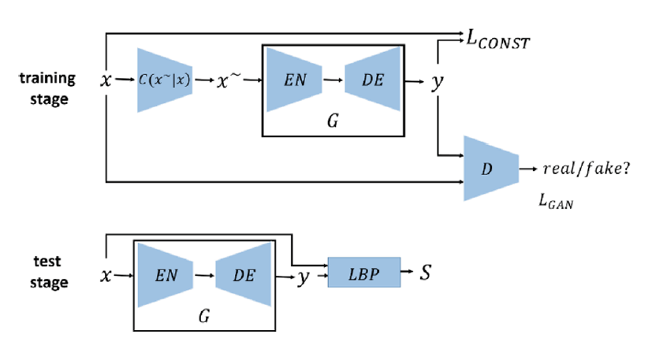
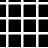
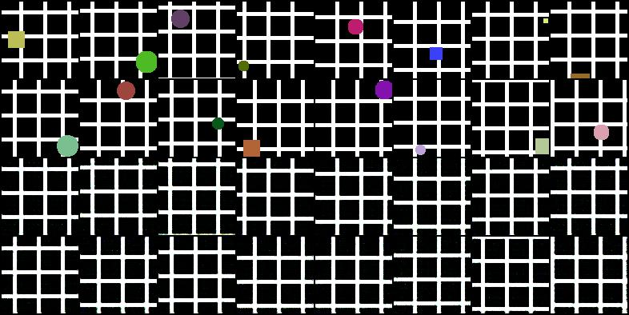
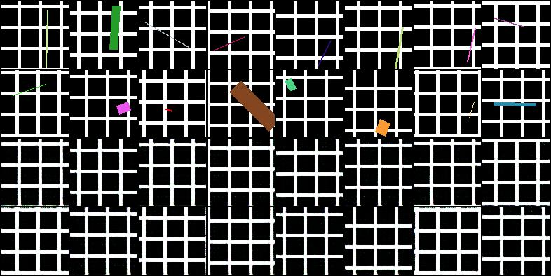

# GAN-defect
This project is mainly based on the paper: [A Surface Defect Detection Method
Based on Positive Samples](https://link.springer.com/chapter/10.1007/978-3-319-97310-4_54).  
The model details in this project may be not completely consistent to the model proposed in the paper.

## Requirements
- pytorch 1.4.0
- torchvision 0.5.0

## Introduction
The model is proved to be able to "repair" the images which are simple and with periodic texture,
here "repair" means generating images without surface defects from the images with defects.

After getting the repaired images, one can use LBP feature to get the defect area, which is proposed in the paper,
or use a segmentation network to output the defect area(to be deployed).

The input images are normal image patches without defects,
the defect will be added automatically during the training process.
The defects can be randomly generated geometric shapes(deployed) or defect patches in the collection.

## Results
The following results come from a simple demo, in which the normal images are artifical grid images(randomly generated).

  
*train data example*

  
*train results(certain batch with 16 images)*

  
*val results(certain batch with 16 images)*

In above result images, the top 2 lines shows the images with surface defect,
and the bottom 2 lines show the corresponding repaired results.

In this demo, the surface defects added in the training process are circles and rectangles,
and the surface defects used in validation process are lines. 
From validation results, it can be observed that when the normal images
are simple enough, the "repair" results are relatively robust to defect color and shape.

## Train and validate
As far the training and validation settings can be modified in `train.py` directly.
Modify the parameters in `class Config` and then run `train.py`.

## Remark
- The segmentation branch is not well deployed so cannot be used now.
- The test part is not completed so far.
- The project is just a demo to verify the methods proposed in the paper mentioned above.
